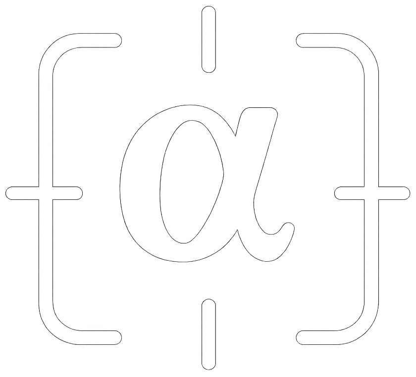

<p align="center">
  
</p>
<h1 align="center">
  Alpha Grab
</h1>
A macOS system tray application for interactive text extraction from screenshots using OCR technology.

## Overview

AlphaGrabApp runs silently in your system tray and allows you to capture screenshots and extract text from them with a simple click. Built with Avalonia UI and .NET 9.0, it provides a lightweight and efficient solution for screenshot-based text extraction.

## Features

- **System Tray Integration**: Runs quietly in the background with easy access from the menu bar
- **Interactive Screenshot Capture**: Uses macOS's native `screencapture` utility for precise selection
- **Text Extraction**: OCR functionality to extract text from captured screenshots
- **Temporary File Management**: Automatic cleanup of screenshot files
- **Cross-Platform UI**: Built with Avalonia for modern, responsive interface

## Requirements

- **macOS**: Required for screenshot capture functionality
- **.NET 9.0**: Runtime required to run the application
- **Screen Recording Permission**: macOS will prompt for permission on first use

## Installation

### Prerequisites

1. Install .NET 9.0 SDK:
   ```bash
   brew install dotnet
   ```

2. Clone the repository:
   ```bash
   git clone <repository-url>
   cd AlphaGrabApp
   ```

### Build and Run

```bash
# Build the application
dotnet build

# Run the application
dotnet run
```

### Development

For development with hot reload:
```bash
dotnet watch run
```

## Usage

1. Launch the application - it will appear in your system tray
2. Click the tray icon and select "Grab Text"
3. Use the interactive screenshot tool to select the area containing text
4. The extracted text will appear in a popup window
5. The temporary screenshot file is automatically deleted

## Architecture

- **Avalonia UI**: Cross-platform .NET UI framework
- **ReactiveUI**: Reactive programming patterns for UI interactions
- **Native macOS Integration**: Uses system screencapture utility
- **Async/Await**: Non-blocking screenshot processing

## Development Status

🚧 **Work in Progress**: The OCR functionality is currently a placeholder that returns the screenshot file path. Full text extraction will be implemented in future updates.

## Contributing

1. Fork the repository
2. Create a feature branch
3. Make your changes
4. Test on macOS
5. Submit a pull request

## License

This project is licensed under the MIT License - see the LICENSE.txt file for details.
